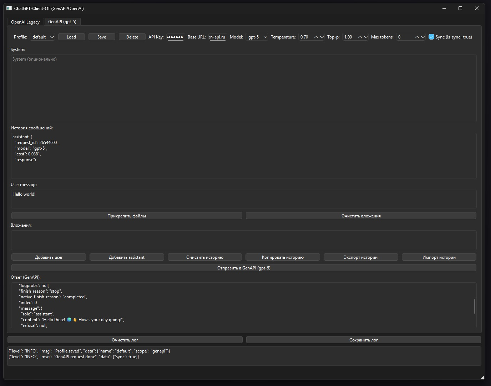

# ChatGPT-Client-QT (GenApi / OpenAI)

### Project information
Gen-Api.ru and Legacy OpenAI connection with GUI

### Precompiled Exe package (pyinstaller)

1. Download [build](https://github.com/ClosedClose/ChatGPT-Client-QT/blob/2a052efa766d42fd35f5b204cb103996cd4c5075/dist/main.exe)
2. Run it

### Usage Py

1. Create .venv, install req's
2. Run main.py

### Screen
